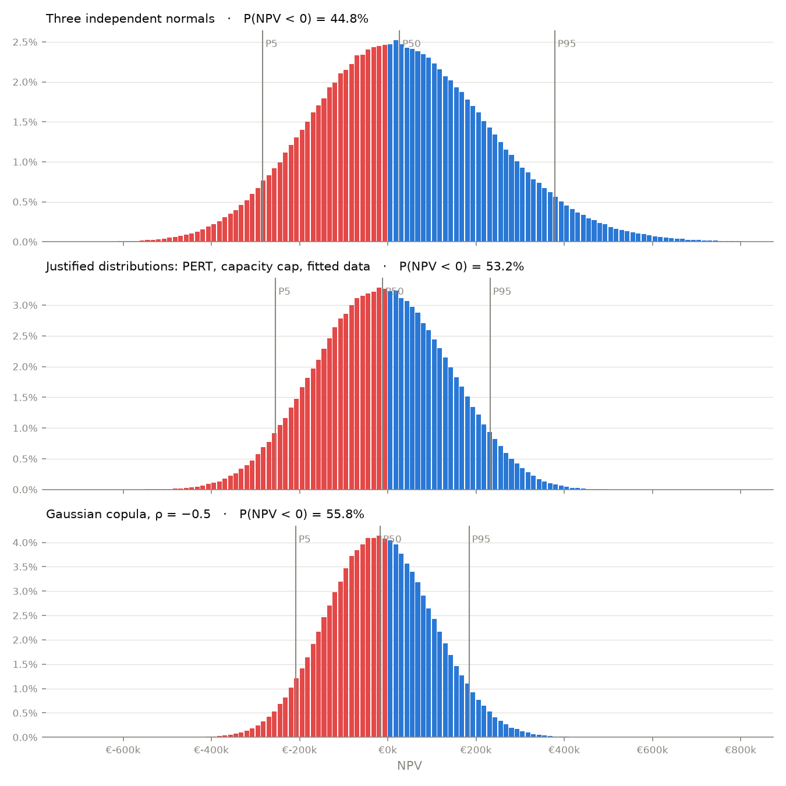

# Monte Carlo Simulation for Valuation

[](https://monte-carlo-valuation.streamlit.app)

A Monte Carlo valuation toolkit built in Excel and Python. It values an investment project and a listed
company, **ASML**, by simulating all value drivers at once and reporting a full distribution of outcomes
with the probabilities attached, rather than a single point estimate.

**Live dashboard:** [monte-carlo-valuation.streamlit.app](https://monte-carlo-valuation.streamlit.app):
edit every assumption and rerun the simulation in the browser.

## Key findings

| | Investment project (NPV) | ASML (value per share) |
| --- | --- | --- |
| Deterministic / central value | €33,973 | €1,210 |
| Monte Carlo mean (1,000,000 iterations) | −€15,688 | €1,210 |
| P5 / P95 | −€208,948 / €184,174 | €766 / €1,796 |
| Probability of the adverse outcome | **P(NPV < 0) = 55.8%** | **P(value < share price of €1,653) = 90.5%** |

- **Investment project.** The base case shows a positive NPV, but once the inputs follow justified
  distributions (downside-skewed price, capacity cap, correlated demand) the mean NPV turns negative: in
  expectation the project does not cover its cost of capital.
- **ASML.** In a three-stage DCF with scenario-weighted revenue regimes, the share price sits in the right
  tail of the distribution. A reverse DCF shows it is consistent with an AI super-cycle: about €106bn of
  revenue in 2030 (company range: €44–60bn) or a WACC of about 7.1%.
- **Validation.** The Python implementation matches the Excel model within sampling error on every
  statistic tested (all z-scores below 2).

> A sensitivity analysis changes one or two variables at a time. **Monte Carlo changes all variables at
> once**, each drawn from a probability distribution, and shows how likely each outcome is.

## 1. Investment project

A 5-year project: an initial investment of €800,000 in Year 0 and operations from Year 1 to Year 5.
There are no taxes, no NWC (Net Working Capital) and no salvage value.

- Annual FCF = Volume × (Price − Variable cost) − Fixed costs
- NPV = FCF × Σ 1 / (1 + r)^t − Initial investment, with r = 10%
- **Base-case NPV = €33,973.09** (Price €50, Volume 15,000, Variable cost €30, Fixed costs €80,000)
- One draw applies to all 5 years: the model captures uncertainty about the *level* of each input, not
  year-to-year noise.

| Input | Distribution | Parameters | Rationale |
| --- | --- | --- | --- |
| Price | PERT | min 44, mode 50, max 52 (α = 4, β = 2) | Three-point expert estimate, downside-skewed risk |
| Demand | Normal | mean 15,000, SD 1,500 | Market study |
| Units sold | — | `min(demand, capacity)`, capacity 17,000 | Sales are capped by production capacity |
| Variable cost | Normal | fitted on 8 historical data points (mean 30.06, sample SD 1.24) | Data shows no clear trend |
| Fixed costs | Constant | €80,000 | Contractual amount |

The Price–Demand correlation (ρ = −0.5) is modelled with a **Gaussian copula**. Standard normals are
correlated through a Cholesky decomposition, mapped to probabilities with U = Φ(X), and passed through
each inverse distribution (PERT⁻¹, Normal⁻¹).



**Results (Python, 1,000,000 iterations, seed 42)**

| | Independent normals | Justified distributions (PERT, cap, data) | Correlated, ρ = −0.5 |
| --- | --- | --- | --- |
| Mean NPV | €34,037 | −€11,940 | −€15,688 |
| Standard deviation | €201,771 | €147,580 | €119,283 |
| P5 / P50 / P95 | −284,061 / 26,151 / 378,352 € | −254,772 / −12,206 / 231,726 € | −208,948 / −17,569 / 184,174 € |
| P(NPV < 0) | 44.8% | 53.2% | 55.8% |
| SE of probability | 0.05 pt | 0.05 pt | 0.05 pt |

The negative Price–Demand correlation narrows the spread (a natural hedge) but lowers the mean, since
E[P × V] = E[P]E[V] + Cov(P, V).

**Validation against Excel.** For every model, the gap between Python and Excel on the mean NPV and on
P(NPV < 0) stays below 2 combined standard errors (at most 1.5). Details are in
[docs/VALIDATION.md](docs/VALIDATION.md); the Excel model is described in [excel/README.md](excel/README.md).

## 2. Case study: valuing ASML

ASML is the sole supplier of EUV lithography systems. In 2025 it reported €32.7bn of sales and a 52.8%
gross margin, and in July 2026 it raised its 2026 guidance to €43–45bn. The same Monte Carlo engine
drives a three-stage DCF built from the 2025 annual report (US GAAP): an explicit forecast for 2026–2030,
a fade period for 2031–2040 in which growth converges to its perpetual rate, and a terminal value by the
value-driver formula, NOPAT × (1 − g / RONIC) / (WACC − g). Eight drivers are uncertain:

- revenue in 2030, as a weighted mixture of three regimes (downturn 20%, base 55%, AI super-cycle 25%);
- gross margin in 2030;
- R&D and SG&A as a share of sales;
- revenue growth in 2031, fading to 2040;
- perpetual growth;
- the risk-free rate, β and the equity risk premium, which build the WACC (Rf + β × ERP).

Revenue and gross margin are linked through a Gaussian copula. Net cash and non-operating assets come
from the 31 December 2025 balance sheet; the value per share is rolled forward to the share-price date
(close of 2 October 2026, €1,653), net of dividends paid.

| Result (1,000,000 iterations) | Value |
| --- | --- |
| Value per share, central scenario | €1,210 |
| P5 / P50 / P95 | €766 / €1,168 / €1,796 |
| **P(intrinsic value < share price)** | **90.5%** (77.8% with a 20x exit multiple as terminal value) |
| P(value < price) in the AI super-cycle regime | 68.8% |
| 2030 revenue implied by the share price (reverse DCF) | €106bn (company range: €44–60bn) |
| WACC implied by the share price | 7.1% (model: 8.7%) |


The size of the 2030 market dominates the tornado chart, followed by growth after 2030 and the
components of the cost of capital. A first version of the model (10-year DCF, Gordon growth on the 2035
FCF) gave P(value < price) = 99.1%: a model that disagrees with the market in 99% of its scenarios is more
likely to be too narrow than the market is to be wrong. Its terminal value implied that ASML would be a
mature company by 2035. The report walks through the changes step by step, with the full assumptions,
sources and limitations: [docs/ASML_REPORT.md](docs/ASML_REPORT.md).

## Dashboard

Every assumption can be edited, along with the number of iterations, the seed and ρ. Each page shows the
statistics with their standard errors, the distribution of outcomes, a tornado chart and a CSV export.
The investment-project page adds the cumulative probability curve and the achieved-correlation check;
the ASML page adds results by revenue regime, a choice of terminal-value method, a reverse DCF, a
comparison with the first version of the model and the central-scenario cash flows.

## Project structure

```
src/mc_valuation/
    assumptions.py    inputs (base case, distributions, correlation, seed), kept separate from the code
    distributions.py  Normal, PERT and PERT mixtures: sampling, inverse CDF (ppf), fitting on data
    model.py          FCF, vectorised NPV, break-even
    correlation.py    Gaussian copula: Cholesky, correlation-matrix checks (positive semi-definite)
    simulation.py     vectorised simulations (no loop over iterations)
    summary.py        Mean, SD, P5, P50, P95, P(NPV < 0) and standard errors
    validation.py     Excel reference results and statistical Python-vs-Excel tests
    asml/             sourced assumptions, three-stage DCF, simulation, tornado, reverse DCF
scripts/run_validation.py   validation tables and charts (results/)
scripts/run_asml.py         ASML valuation results and chart
Investment_project_NPV.py   dashboard, investment-project page
pages/ASML_valuation.py     dashboard, ASML page
tests/                      pytest suite (42 tests)
docs/                       validation findings, ASML report, code walkthrough
excel/                      Excel reference model
```

## Getting started

```bash
python3 -m venv .venv
source .venv/bin/activate
pip install -r requirements.txt

pytest                                    # 42 tests, including base-case NPV = €33,973.09
python scripts/run_validation.py          # Excel vs Python at 5,000 and 1,000,000 iterations
python scripts/run_asml.py                # ASML Monte Carlo valuation
streamlit run Investment_project_NPV.py   # dashboard ("ASML valuation" page in the sidebar)
```

## Tech stack

Python · NumPy · SciPy · pandas · Matplotlib · Plotly · Streamlit · pytest · Excel

A module-by-module explanation of the code is in [docs/CODE_WALKTHROUGH.md](docs/CODE_WALKTHROUGH.md).

## Disclaimer

The ASML valuation is an analytical exercise based on public information and on stated assumptions. It
is not investment advice.

---

Yacine Haddouche
