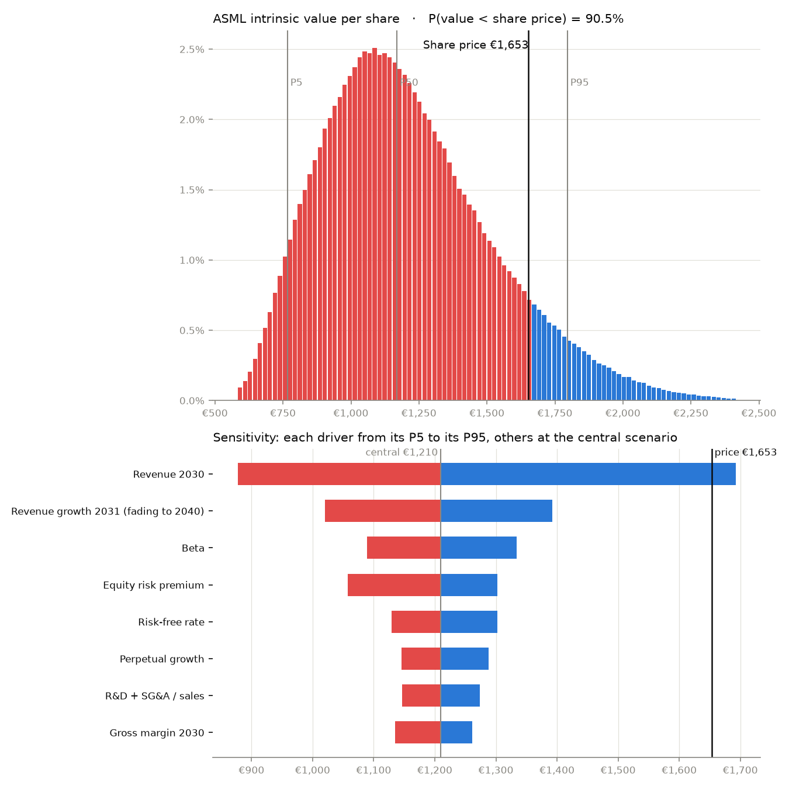

# ASML: how likely is the share to be worth less than its price?

*Three-stage DCF valuation with Monte Carlo simulation · financials from the 2025 Annual Report (US GAAP),
2026 guidance from the Q2 2026 results, share price at 2 October 2026*

## 1. Question and short answer

ASML is the sole supplier of EUV lithography systems, the machines needed to print the most advanced
chips. In 2025 it reported €32.7bn of sales (+15.6%), a 52.8% gross margin and €9.6bn of net income. In
July 2026 it raised its 2026 sales guidance to €43–45bn on the back of AI-driven demand. The share
closed at €1,653 on 2 October 2026, a market capitalisation of about €637bn, or roughly 45 times our
estimate of 2026 operating profit after tax (NOPAT).

A single-scenario DCF hides how much this price depends on a few assumptions. We therefore simulate
1,000,000 scenarios in which eight value drivers move at the same time, each following a justified
probability distribution. The question is: **what is the probability that the intrinsic value per share
is below the share price?**

**Answer: 90.5%** (standard error 0.03 point). The central scenario gives €1,210 per share, the median
€1,168, and 9.5% of scenarios exceed the share price. The price is consistent with our **AI super-cycle**
regime: with the other drivers at their central value, it requires **€106bn of revenue in 2030**, against
€75bn in our base regime and €44–60bn in ASML's own (now outdated) 2030 range. Cross-checking the terminal
value with a 20x exit multiple instead of the value-driver formula lowers the probability to 77.8%.

## 2. Model

**Scope.** Nominal-euro DCF. Year 0 is 31 December 2025, the date of the latest annual balance sheet.
The model has three stages:

1. **2026–2030, explicit forecast.** Revenue starts at €44bn in 2026 (midpoint of the updated guidance)
   and grows at a constant rate up to the simulated 2030 level. The gross margin moves from 55% (2026
   guidance) and the R&D + SG&A ratio from 17.0% (H1 2026 actual) to their simulated 2030 levels.
2. **2031–2040, fade.** Revenue grows at the simulated 2031 rate, which fades linearly to the perpetual
   growth rate by 2040. Margins stay at their 2030 level.
3. **Terminal value at the end of 2040**, by the value-driver formula:

   TV = NOPAT₂₀₄₁ × (1 − g / RONIC) / (WACC − g)

   Growing at g requires reinvesting g / RONIC of profits each year, where RONIC is the return on new
   invested capital. ASML earned about 106% on its invested capital in 2025 (NOPAT of €9.3bn on €8.8bn),
   flattered by customer prepayments. In perpetuity we assume 40%: still far above the cost of capital
   (the EUV monopoly), but well below today's level.

**Cash flows, for each year.**

- **EBIT** = sales × (gross margin − R&D and SG&A ratio). R&D and SG&A already include depreciation.
- **Tax** at 17%, the 2026 effective-rate guidance. NOPAT = EBIT − tax.
- **FCF** = NOPAT + D&A − capex − investment in working capital, with:
  - D&A at 3.5% of sales (3.1% in 2025);
  - capex (property, plant, equipment and intangibles) at 5.0% of sales (5.0% in 2025, 7.4% in 2024);
  - working capital at 10% of each additional euro of sales. Inventories (€11.4bn) are largely funded by
    customer prepayments (€19.4bn of contract liabilities), which unwound in H1 2026.
- FCFs are discounted at the WACC.

**WACC.** Cost of equity by the CAPM, Rf + β × ERP, with each component simulated. Debt is under 1% of
value, so the WACC equals the cost of equity.

**From Enterprise Value to value per share.**

- Add net cash at 31 December 2025: €13.32bn of cash and short-term investments − €4.39bn of debt
  (Eurobonds and borrowings) − €0.25bn of leases = **€8.68bn**.
- Add non-operating assets at book value: the 24.9% stake in Carl Zeiss SMT (€0.82bn) and equity
  investments, mainly Mistral AI (€1.32bn).
- Divide by the 385.4m shares outstanding at 31 December 2025.
- Roll the result forward to the share-price date: grow it at the cost of capital for 9 months, then
  subtract the €6.18 of dividends per share paid in between (€1.60 + €2.70 + €1.88).

**Consistency with reported figures.** The central scenario gives a 2026 FCF of €12.1bn, against
€11.0bn of free cash flow reported for 2025 and an expected 35% jump in sales. Its 2026 operating margin
(38%) compares with 34.6% in 2025.

## 3. Uncertain drivers and distributions

| Driver | Distribution | Parameters | Rationale |
| --- | --- | --- | --- |
| Revenue 2030 | Mixture of three PERTs | Downturn 20%: €45 / 55 / 65bn · Base 55%: €60 / 75 / 90bn · AI super-cycle 25%: €85 / 100 / 125bn | The 2024 Investor Day range (€44–60bn) is outdated now that 2026 is guided at €43–45bn. The downturn regime (6% a year from 2026) covers an AI capex digestion and tighter export controls on China (29% of 2025 sales); semiconductor equipment has had a downturn every 3–5 years. The base regime (14% a year) is the AI capacity build-out. The super-cycle regime (23% a year) adds more EUV layers per wafer and fast High-NA adoption. |
| Gross margin 2030 | PERT | 54% / 59% / 62% | Company target for 2030: 56–60%. 52.8% in 2025, 54–56% guided for 2026. EUV mix and installed-base services push it up; early High-NA systems dilute it. |
| R&D + SG&A / sales (mature) | Normal | mean 15%, SD 1.5% | 18.2% in 2025, 17.0% in H1 2026: costs grow more slowly than sales. |
| Revenue growth in 2031 (fading to 2040) | PERT | 0% / 8% / 14% | Semiconductor equipment is cyclical: a flat period after the AI build-out is possible, while the EUV monopoly supports a long fade. |
| Perpetual growth | PERT | 1.5% / 2.5% / 3.5% | About inflation (2%) plus a share of real growth in chip demand. |
| Risk-free rate | Normal | mean 3.6%, SD 0.25% | 10-year Bund yield, late September 2026. |
| β | PERT | 1.0 / 1.2 / 1.45 | From 1.15 (1-year raw) to 1.43 (5-year, Blume-adjusted). |
| Equity risk premium | PERT | 3.75% / 4.25% / 5.5% | Mode at the implied premium of 4.23% (Damodaran, January 2026); 5.5% at the top of the range used by practitioners. |

The resulting WACC has a central value of 8.7% and a P5–P95 range of 8.0–9.9%, slightly skewed to the
right because β and the premium multiply each other.

**Why a mixture for revenue.** A single PERT gives one smooth, bell-shaped range. A scenario-weighted
mixture states explicitly how likely a downturn, a normal build-out and a super-cycle are, and produces
the fat right tail that a market price may be paying for. A mixture has no closed-form inverse CDF, so
the code tabulates its CDF on a fine grid and interpolates backwards.

**One draw applies to the whole horizon**: the model captures uncertainty about the level of each
driver, not year-to-year cycles.

**Correlation.** Revenue and gross margin are linked through a Gaussian copula (Cholesky, then
U = Φ(X), then each inverse distribution), with **ρ = +0.5**. ASML's own targets pair them: €44bn of
revenue goes with a 56% margin, €60bn with 60%, through operating leverage and the EUV mix. We also test
ρ = 0 and ρ = +0.8. The other drivers are independent.

## 4. Results (1,000,000 iterations, seed 42)

| Statistic | Value |
| --- | --- |
| Value, central scenario (modes and means) | €1,210 |
| Mean value per share (SE) | €1,210 (€0.31) |
| Standard deviation | €315 |
| P5 / P50 / P95 | €766 / €1,168 / €1,796 |
| **P(value < share price of €1,653)** | **90.5%** (SE 0.03 pt) |

**Within each revenue regime** (each simulated on its own, the other drivers unchanged):

| Regime | Probability | Mean value per share | P(value < price) |
| --- | --- | --- | --- |
| Downturn | 20% | €890 | 100.0% |
| Base | 55% | €1,170 | 98.3% |
| AI super-cycle | 25% | €1,542 | 68.8% |

**Reading the results.**

1. **The share price sits in the right tail.** It is above the P90 of our distribution. The scenarios that
   exceed it are almost all super-cycle scenarios, and even within that regime most of them stay below
   the price: the market pays for a super-cycle *and* a low cost of capital or long-lasting growth after
   2030.
2. **Terminal value no longer dominates.** With a 15-year horizon, it accounts for 48% of the central
   Enterprise Value (€429bn), against 61% in the first version of the model. The value-driver formula
   implies a terminal value of about 15x next-year NOPAT (P5–P95: 12.5x–17.6x), a mature-company multiple,
   reached only in 2041.
3. **The correlation barely changes the answer.** A positive revenue–margin correlation widens the
   spread (SD €299 → €324 from ρ = 0 to ρ = +0.8), but P(value < price) only moves from 91.6% to 89.8%.

**Terminal-value cross-check.** Replacing the value-driver formula with an exit multiple of 20x next-year
NOPAT (in line with the long-run earnings multiples of mature semiconductor-equipment companies) gives a
central value of €1,395, a mean of €1,401 and **P(value < price) = 77.8%**. The conclusion holds, but its
strength depends on how much of ASML's premium is assumed to survive after 2040.

## 5. Sensitivities: what does the market assume?

**Tornado chart.** Each driver moves from its P5 to its P95, the others staying at their central value:

| Driver | Driver P5 → P95 | Value per share | Swing |
| --- | --- | --- | --- |
| Revenue 2030 | €52bn → €108bn | €878 → €1,692 | €815 |
| Revenue growth 2031 (fading to 2040) | 3.2% → 11.9% | €1,020 → €1,393 | €373 |
| β | 1.07 → 1.35 | €1,334 → €1,089 | €245 |
| Equity risk premium | 3.9% → 4.9% | €1,302 → €1,057 | €245 |
| Risk-free rate | 3.2% → 4.0% | €1,302 → €1,130 | €172 |
| Perpetual growth | 1.9% → 3.1% | €1,146 → €1,288 | €142 |
| R&D + SG&A / sales | 12.5% → 17.5% | €1,274 → €1,146 | €127 |
| Gross margin 2030 | 56.1% → 61.0% | €1,135 → €1,261 | €126 |

The **size of the 2030 market** dominates, followed by how long growth lasts after 2030 and by the three
components of the cost of capital. Margins matter much less: ASML's profitability is already high, and the
uncertainty lies in volumes and in the risk premium.

**Reverse DCF.** We solve for the value of each driver that exactly justifies the €1,653 share price,
with the others at their central value (`scipy.optimize.brentq`):

- **2030 revenue of €106bn** (central: €75bn), i.e. 25% growth a year from 2026, the super-cycle regime;
- or **16.5% revenue growth in 2031**, fading to 2040 (central: 8%);
- or a **WACC of 7.1%** (central: 8.7%), i.e. a β of about 0.8 with our risk-free rate and premium.

## 6. From the first version of the model

A first version used a 10-year DCF, a Gordon growth terminal value on the 2035 FCF, a fixed 2.5% perpetual
growth rate, a single WACC distribution centred on 9.0% and a single PERT for 2030 revenue. It gave a
central value of €1,068 and **P(value < price) = 99.1%**.

A model that disagrees with the market in 99% of its scenarios is more likely to be too narrow than the
market is to be wrong. The diagnosis was that the terminal value assumed ASML would be a mature company
by 2035, worth about 15x NOPAT, while the market pays about 45x today. The central value moves as follows:

| Step | Value per share | Change |
| --- | --- | --- |
| First version: 10-year DCF, Gordon growth on the 2035 FCF, WACC 9.0% | €1,068 | |
| Fade period extended to 2040 (three-stage DCF) | €1,158 | +€90 |
| Terminal value by the value-driver formula (RONIC 40%) | €1,150 | −€7 |
| WACC built from Rf + β × ERP (8.7%) | €1,210 | +€60 |

The revenue regimes, the uncertain perpetual growth and the decomposed WACC do not move the central value
much, but they widen the distribution, and that is what brings P(value < price) from 99.1% to 90.5%. The
assumptions were not tuned to reach the share price: each change is justified on its own, and the
conclusion still points the same way.

## 7. Limitations

- **Distributions are judgement calls.** In particular, the regime weights (20% / 55% / 25%) and the
  revenue ranges are not observable. Analysts with a more optimistic view on AI demand would reach higher
  values: the average analyst price target is about €2,045. The dashboard lets every parameter be changed.
- **The cost of capital is decisive and hard to pin down.** Every half point of WACC is worth roughly
  €60–100 per share.
- **Long-run returns.** A 40% RONIC in perpetuity is an assumption about how long the EUV monopoly lasts;
  the exit-multiple cross-check shows how much this matters.
- **No explicit cycle.** One level per driver over the whole horizon smooths the semiconductor cycle.
  Real cash flows are lumpier.
- **Capital returns.** Buybacks at a price above intrinsic value would transfer value from remaining to
  selling shareholders; the model ignores this, as well as future share-based dilution.
- **Mixed dates.** The balance sheet is at 31 December 2025, the guidance at July 2026 and the share
  price at October 2026. The roll-forward adjusts for time and dividends, not for news since then.

## 8. Conclusion

**90.5% of simulated scenarios give an intrinsic value below the €1,653 share price** (77.8% with an
exit-multiple terminal value), and the central value is €1,210. The share price is consistent with an AI
super-cycle: about €106bn of revenue in 2030, or a cost of capital of about 7.1%. ASML is an exceptional
business; the question this analysis raises is not its quality, but how much of a long AI super-cycle the
current price already assumes.

---

**Sources.** ASML, *Annual Report 2025* (US GAAP): consolidated statements of operations, balance sheet and
cash flows (pages 276–281), notes 2, 14 and 16, CFO letter (page 52); ASML Q2 2026 results press release
(15 July 2026); Euronext Amsterdam share price (via stockanalysis.com); 10-year Bund yield (Trading
Economics, September 2026); β (Intrinio); implied equity risk premium (A. Damodaran, January 2026).

**Reproducibility.** `python scripts/run_asml.py` and `streamlit run Investment_project_NPV.py`
("ASML valuation" page).
